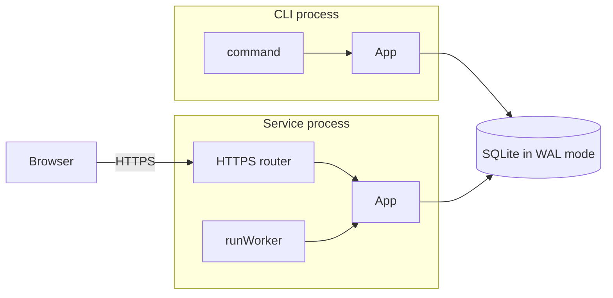

Sprout is a Go application template with per-user installation, shared SQLite
state, an optional service and dashboard, and signed updates. Each CLI command
runs in its own process. The service is one of those commands.

## Design choices

A project created from Sprout owns its source and can diverge immediately.
There is no Sprout runtime dependency or requirement to keep up with upstream.
The template provides a working starting point for applications whose needs
will differ over time.

The code favors the standard library, explicit subsystem boundaries, and a
small set of dependencies. Linux and Windows share an installation protocol;
platform-specific code handles paths, locks, and service management. Keeping
that scope limited makes it practical to test the full lifecycle.

## Platform support

Development runs on Linux or WSL. Released applications run on Linux, WSL,
and native Windows 11, on `amd64` and `arm64`. WSL uses the Linux installer
and binaries; native Windows uses the PowerShell installer and scheduled tasks.

macOS and BSD are outside the project's scope. Supporting them would mean
additional service managers, installers, and lifecycle tests. Direct distribution
on macOS also brings its own signing and distribution requirements. It's just too
much for a solo project. This is the same reason Alpine and Void fallback to
non-service installs.

### Linux distro matrix

Linux binaries are static. Managed service setup depends on a working
`systemd --user` version 246 or newer. Without it, the installer skips service
registration; the binary still works, and the worker can run with
`<APP> service run` or a service definition you supply.

The full E2E harness covers eight base distro images. Related distributions below
are considered by the installer design, but are not each tested. These are runtime
expectations; development still needs the tools in
[Getting started]({}#prerequisites).

| Distributions | Service | Coverage |
|---|---|---|
| Debian, MX Linux, Raspberry Pi OS | User systemd where available | Debian E2E; derivatives considered. Non-systemd MX setups use the binary-only path. |
| Ubuntu, Mint, Pop!_OS, Zorin | User systemd | Ubuntu E2E; derivatives considered. |
| Fedora | User systemd | Fedora E2E. |
| Rocky, AlmaLinux, RHEL | User systemd | Rocky E2E; AlmaLinux and RHEL considered. |
| Arch, CachyOS, Manjaro, Omarchy | User systemd | Arch E2E; derivatives considered. |
| SteamOS | User systemd in desktop mode | Considered; no dedicated E2E image. Installation stays in the user's home. |
| Silverblue, Kinoite, Bazzite, Bluefin, Aurora | User systemd | Immutable-root dependency handling is simulated; no individual distro E2E. |
| openSUSE Tumbleweed, Leap | User systemd | Tumbleweed E2E; Leap considered. |
| MicroOS, Aeon, Kalpa | User systemd where available | Immutable-root handling considered; no individual distro E2E. |
| Alpine | Foreground worker or your own OpenRC service | Alpine E2E with musl and BusyBox. |
| Void | Foreground worker or your own runit service | Void E2E with glibc. |
| NixOS | User systemd | Considered; outside the E2E matrix. Development uses `nix develop`. |
| Artix, Devuan, Gentoo | Depends on the configured init system | Considered; no dedicated E2E image. Non-systemd setups use the binary-only path. |

On detected immutable roots, missing-tool instructions point to Homebrew when
`brew` is available. Otherwise, they direct users to their distribution's supported
method for installing tools on the host. Both note that package names may differ
from the missing command names.
The simulated immutable case checks those instructions, not a full installation
on each immutable distribution.

WSL follows its installed distro's row and needs a functioning user systemd
manager for managed service operation. Native Windows has a separate installer
harness in CI. See [Testing](#testing) for coverage and limits.

## Processes



`cmd/main.go` creates an `App` and registers the CLI commands. Normal startup
resolves the storage layout, checks lifecycle state, takes a shared lifecycle
lock, and records a PID marker. It then starts rotating logs, opens SQLite,
checks the schema version, and loads configuration.

Commands receive the `App` containing these resources. Cleanup runs in reverse
order. Errors return to `main`, where they are logged and printed with a
nonzero exit status.

## SQLite

The database lives under `data/db/` in the per-user storage root:
`~/.<APP>` on Linux and `%LOCALAPPDATA%\<APP>` on Windows. Each process uses
`database/sql` with `ncruces/go-sqlite3`, which runs SQLite without cgo by
doing a three step machine-translation (C -> WASM -> Go).

The driver must remain at `v0.35.3` or newer. Earlier versions have a
[Windows multi-process WAL corruption bug](https://github.com/ncruces/go-sqlite3/issues/404).
The fix requires Windows 10 1803 or Server 2019 or newer; Sprout targets Windows 11.

WAL allows concurrent readers while SQLite serializes writes. A busy timeout
and eager write transactions allow brief contention to wait. Each process has
a pool of four connections; every Wasm connection owns a memory sandbox, and
more connections do not add concurrent writers.

The initial schema contains JSON configuration with transactional `View` and
`Update` accessors, dashboard sessions when HTTPS is retained, and hash requests
when the service is retained. The hash command demonstrates IPC: the CLI inserts
a request, the worker writes the SHA-256 result, and the CLI reads it back.

### Migrations

Migrations are ordered functions in `internal/platform/database/migration.go`.
Each database step and its `PRAGMA user_version` advance commit together.
New installations run all steps from version zero; upgrades run the remaining
steps. Non-database side effects must be idempotent because SQLite cannot roll
back a file write or external API call.

Normal processes reject a schema mismatch. The installer authorizes migrations
in production. An isolated dev build can initialize a version-zero database.

## Installation lifecycle

Processes share `control/lifecycle.lock` and record PID markers under
`control/instances/`. Before changing an installation, the installer atomically
publishes a transitional phase in `control/state.json`: `installing`, `updating`,
or `uninstalling`, with the target version and a fresh migration nonce.

Every running process watches that state and cancels its context when the phase
leaves `ready`, or the version or installation epoch changes. New processes
refuse to start during a transition. The installer stops matching processes,
takes the exclusive lifecycle lock, replaces installed state, and invokes the
new binary's migration path. Migration requires the matching phase, version,
and nonce. Success publishes `ready` while the exclusive lock is still held.

SQLite coordinates ordinary data access. The lifecycle lock keeps old processes
out of the database during binary replacement and migration. PID shutdown checks
also match the executable path, so a reused PID does not cause an unrelated
process to be stopped. After taking the exclusive lock, the installer removes
stale markers.

**Invoking migration is the point of no return.** Before it, failure can restore
the previous binary, release source, and service definition. Once migration may
have changed state, failure leaves the installation transitional. Rerunning the
installer recovers it. Downgrade support would require a coordinated database
snapshot and reversal of external side effects.

Any additional process that opens this database must join the lifecycle
protocol: state check and watcher, shared lock, and PID marker. The installer's
shutdown logic must also recognize its executable. See
`internal/maintenance/guard.go` and `docs/MAINTENANCE.md` before extending it.

All coordination files live in the storage root; there is no separate runtime
directory. On Linux, application-owned directories require user ownership and
mode `0700`. Unsafe permissions and symlinks are rejected. Uninstall retains
`control/`, `maintenance/`, and `logs/` for recovery.

## Service

The service starts `runWorker(ctx, app)` and any retained dashboard listeners
under one cancellation context. It reports readiness after all components are
ready. If one fails, it cancels the others, waits for cleanup, and joins their
errors.

Linux uses a per-user systemd unit; Windows uses a per-user scheduled task.
Both invoke `service run`. A process-lifetime lock on `control/service.lock`
keeps the service a singleton, including when started manually. The example
queue relies on this single-consumer guarantee.

### Windows shutdown

Task Scheduler has no graceful stop operation. Controllers write an expiring
`control/service.stop` lease, which the service checks every 250 ms. The
coordinator cancels the worker and listeners and waits for them to finish.
The controller waits for Task Scheduler to report the stopped state, using
`schtasks /End` only after a timeout.

Restart waits for shutdown before clearing the lease and starting the task;
otherwise Task Scheduler's `IgnoreNew` policy can discard the start. Start also
clears stale leases. A controller retires only its own stop request. Install,
update, uninstall, and dashboard controls use the same protocol.

## Dashboard

The HTTPS feature owns routing, handlers, templates, assets, credentials,
sessions, permissions, certificates, and listeners. The main listener always
uses HTTPS. An optional plain HTTP listener accepts only loopback binds for a
local reverse proxy. Both serve the same router.

The router consults `X-Forwarded-Proto` only for requests arriving without TLS.
Its trust therefore depends on the plain listener remaining loopback-only.
Adding a non-loopback plain listener requires explicit proxy trust handling.

On first run, Sprout generates an ECDSA P-256 certificate with SANs for localhost,
loopback, the hostname, and detected interface addresses. The pair is reused
across restarts. On Linux, its directory is `0700` and key is `0600`; loosened
permissions cause startup to fail. Deleting the pair allows regeneration.

Credentials are created through the CLI. Usernames are normalized and unique;
passwords use Argon2id. SQLite sessions survive restarts and are revoked when
their credential is removed. A session stores the SHA-256 of a random 256-bit
cookie token, the username, and permissions. Sessions expire 30 minutes after
login without renewal. Cookies have the same lifetime and use HttpOnly,
SameSite=Strict, and Secure outside dev builds.

Login performs one password comparison, including a dummy comparison for unknown
users. Each router has a login limiter and bounded password-verification slots.
Static assets and login are public; settings and controls require a session.
Production writes require a matching `Origin`, plus a JSON content type on JSON
endpoints. Security headers wrap every route.

The starter permissions are `settings`, `server.control`, and `admin`. Reads
require a session; writes check the relevant permission. Application-specific
permissions belong in `internal/types/perms.go`. Extend this local dashboard
baseline to match your application's exposure and data.

Source assets and templates live under `internal/ui`. The build uses Tailwind,
DaisyUI, and esbuild, hashes the outputs, and embeds them into the binary.
There is no npm project. New configurations bind to loopback; LAN access requires
an explicit bind change. Dev builds bypass auth and use isolated `-dev` storage.

## Updates

Feature selection controls update capabilities:

```text
update                         discovery and notices
└── update.apply               user-requested application
    └── update.apply.auto      unattended application; also needs service

service                        background worker
└── service.https              dashboard
```

Cutting a prerequisite also cuts its dependents. All feature combinations still
support updates by rerunning the installer. Notifications and background checks
default to enabled; unattended application requires an explicit installation
preference and a running service. Ordinary CLI commands never install updates
in the background.

Periodic checks share an expiring database lease across processes. Success
commits the result and releases the lease. Failure leaves it until expiry to
avoid rapid replacement checks. Explicit user checks bypass that lease.
Availability is derived from the running version, release source, and cached
check result; installer admission has separate job state.

### Detached installation

An application-driven update downloads the installer, verifies its cosign
identity, and launches a detached job. The installer then owns shutdown,
replacement, migration, recovery, and restart. On Linux, a caller in the
systemd-managed service uses `systemd-run --user`, so stopping the service does
not stop its updater. CLI and manually run service callers detach into their
own session. Cosign is resolved from `~/.local/bin/cosign` first, then `PATH`.

Each job runs under `maintenance/jobs/<id>/` and removes its directory on exit.
The admitting process uses that cleanup to detect a failure before the installer
drained it. The runner records its process identity so a directory left by a
provably dead runner can also be reaped and retried. Platform identity checks
are specified in `docs/MAINTENANCE.md`.

### Release sources and mirrors

The installer persists its effective source in `maintenance/release-url`,
including an `APP_RELEASE_URL` override. That metadata participates in rollback.
Checks and detached jobs use the saved source; a detached updater passes it to
the next installer. Missing or invalid metadata prevents updating rather than
falling back to the public host.

Signatures cover artifact bytes and the original workflow identity, so unchanged
artifacts verify from a mirror. Its `version` pointer decides which release users
can discover. Changing the source does not change the trusted signer.
[Run a mirror]({}) covers staging and
promotion.

A modified installer needs a new signature and explicit trust in its signer.
Its binary checks may still trust the original signer, but application-driven
updates reject installers signed only by the mirror operator. Those installers
must be verified and run separately.

## Releases

`scripts/build.sh` builds binaries on your machine. It also holds the project
settings used by both local builds and releases.

`scripts/ci.sh` runs the release process in GitHub Actions. It has two commands:

```sh
./scripts/ci.sh --plan     # check which tests to run
./scripts/ci.sh --execute  # publish a release or finish an interrupted attempt
```

The workflow runs `--plan`, waits for the tests it requests, and then runs
`--execute`. These commands need the repository identity and R2 credentials
configured in [Publish a release]({}).
The detailed upload and recovery code lives under `scripts/ci/`.

### Deciding which tests to run

The plan reads the newest version heading in `CHANGELOG.md` and checks the
release host and Git tag. It verifies any existing release files using their
signatures and checksums.

- If the version has no Git tag yet, run the Linux and Windows E2E jobs and,
  in the upstream template, the feature-cut matrix. Files left by an interrupted
  upload do not count as a completed release.
- If the version is already tagged, skip those jobs. The publisher checks
  for installer changes and tests changed installers before replacing them.

For a retry, consider this example: v1.0.0 became available to users, but its
workflow failed to push the Git tag. You then published v1.1.0. Retrying the
v1.0.0 workflow skips E2E, pushes the missing v1.0.0 tag, and runs the usual
old-release cleanup. The release host continues offering v1.1.0 to users.

Pull requests always run validation. They do not contact the release host or
need its credentials.

### Publishing files

Each version has its own directory on the release host. Once a complete release
has been uploaded and verified, its files are never replaced. The root `version`
file tells installers which version to download. Root installer scripts can be
updated separately from the application binaries.

Paths below are relative to `RELEASE_URL`. If that URL includes a path such as
`/my-app/`, all publication and cleanup stay inside that path in the bucket.

```text
install.sh
install.sh.cosign.bundle
install.ps1
install.ps1.cosign.bundle
version
releases/
  v1.0.0/
    version
    linux-amd64.gz
    linux-arm64.gz
    windows-amd64.exe.gz
    windows-arm64.exe.gz
    checksums.txt
    checksums.txt.cosign.bundle
```

Publication proceeds in this order:

1. Build, package, and sign the application, unless verified files for this
   version are already on the release host.
2. Upload the files to `releases/<version>/` and check their signatures and
   checksums after downloading them again.
3. Generate the installer scripts from the project settings. Test changed
   installers against both the new version and the version currently offered
   to users, then sign and upload them.
4. Update the root `version` file to make the new release available to installers.
5. Save the release commit and publication time, push the Git tag, and remove
   old releases according to the rules below.

An installer's signature bundle is uploaded before its script. While those two
files are being replaced, a download can briefly contain a mismatched pair;
verification rejects it. The publisher keeps verified temporary copies so a
retry can finish replacing the pair. Unchanged installers keep their existing
signatures.

Installers read the root `version` file once and use that version throughout
installation. A retry can use a fresh runner: it downloads and verifies the
release files to find out which steps are complete. It stops on damaged files
or conflicting release records instead of overwriting them. It also refuses to
move an existing tag or make an older version current again.

The publisher keeps the two newest promoted releases and any older release
until at least 24 hours after its promotion. More than two may therefore remain
in the bucket. Mirror operators maintain their own retention schedule.

[Publish a release]({}) covers setup,
verification, and recovery procedures.

### Build tools and signing

Third-party tool versions live in `scripts/vendor.sh`. Downloaded executables
and assets are verified against SHA-256 pins on every use. Esbuild and goimports
are installed through Go modules and the checksum database. Local builds may use
Tailwind from `PATH` for Nix environments; CI uses the pinned download.

GitHub Actions are pinned to commit SHAs. The release job alone requests
`contents: write` for tags and `id-token: write` for keyless cosign signing.
The signing identity includes the repository and
`.github/workflows/release.yml@refs/heads/main`; changing that identity breaks
verification for existing installations.

## Template finalization

Optional source is fenced with feature ownership markers. Nested blocks require
both owners; whole-feature prerequisites live in `internal/cut/features.go`.
The reserved `template` owner marks tooling removed by every finalization.

```go
// --- BEGIN update.apply ---
// optional code
// --- END update.apply ---

// --- FILE service.https ---
```

Equivalent marker forms exist for shell, YAML, HTML, and CSS. Preview validates
markers and module references without changing files. Finalization deletes
selected files and blocks, renames module references, strips markers, runs
`goimports` and `go mod tidy`, and checks the resulting tree. File modes and line
endings are preserved. The finalized application contains no cutter.

## Testing

Tests use Go's standard `testing` package and live beside the code. Database
tests open real SQLite in temporary directories. Auth tests use real password
comparisons and sessions. Subprocess tests exercise database initialization,
TLS generation, shared log rotation, and lifecycle lock exclusion across
independent processes.

The upstream cut matrix tests all eleven valid feature combinations on Linux
and Windows. It finalizes temporary copies with replacement module paths and
checks compilation, tests, and surviving shell scripts. The cutter and matrix
are removed from finalized projects.

Linux lifecycle tests build a production binary and install it in unprivileged
Incus system containers. Coverage includes Debian, Ubuntu, Fedora, Arch, Alpine,
openSUSE, Void, and Rocky. Systemd cases run real user managers; Alpine and Void
exercise binary-only installation. Probes cover service state, the hash worker,
HTTPS health, restart, reinstall, migration failure, and recovery. Containers
share the host kernel.

In the upstream template, the default run also tests `no-update`, `no-service`,
and `headless` source variants on Debian. Finalized forks test their retained
features. Runs using `--release-dir` test the supplied release files.

Per-case logs remain under `out/lifecycle-e2e-logs/<run>/`. `KEEP_FAILED=true`
retains failed containers and backing directories for inspection. Windows CI
runs the native Go suite and a PowerShell installer harness covering upgrades,
process shutdown, stale markers, and version pinning.

Release tests use an rclone local backend and a cosign stand-in. They exercise
interruption, resume, promotion, installer pair recovery, immutable tags, and
retention without a real bucket. Lifecycle fixtures skip signature verification
with `APP_SKIP_VERIFY=true`; binary SHA-256 checks still run.

See [Build and run]({}#test-your-changes)
for test commands and Incus setup.

### CI jobs

Set the repository variable `CI_ENABLED=true` to enable the workflow. Until
then, only the small `ci-gate` job runs.

| Job | What it does |
|---|---|
| `release-plan` | Runs `ci.sh --plan` on pushes to `main`. For PRs, enables validation without checking the release host. |
| `cut-matrix` | Tests every supported feature combination. Present only in the upstream template. |
| `linux-e2e` | Runs Linux Go tests, shell lint, release tests, and installer tests on several distributions. |
| `windows-e2e` | Runs native Go tests, representative feature cuts, PowerShell parsing, and Windows installer tests. |
| `release` | Runs `ci.sh --execute` on pushes to `main`, after all requested tests pass. Sets up Incus only if installers need testing. |

The three validation jobs follow the rules in [Deciding which tests to
run](#deciding-which-tests-to-run). A failed plan, failed test, or cancellation
blocks publication. Tests skipped at the plan's request allow publication to
continue.

## Code map

| Path | Responsibility |
|---|---|
| `cmd/main.go` | Process entry, flags, and final error handling |
| `internal/app` | Resource initialization, cleanup, update checks, job admission |
| `internal/app/commands` | CLI commands, service coordination, worker |
| `internal/maintenance` | Lifecycle state, locks, detached installers |
| `internal/layout` | Filesystem paths and permissions |
| `internal/platform/database` | SQLite, migrations, accessors |
| `internal/platform/http` | Listeners, routing, authentication, handlers |
| `internal/platform/secrets` | TLS generation and storage |
| `internal/ui` | Templates and frontend source |
| `internal/build` | Values compiled into the binary |
| `pkg` | Shared utilities: locks, logs, HTTP, crypto, prompts, systemd notification |
| `scripts/build.sh`, `scripts/build/` | Project settings, local builds, and shared artifact helpers |
| `scripts/ci.sh`, `scripts/ci/` | Release planning, publication, and recovery |
| `scripts/vendor.sh` | Pinned tools and downloads |
| `scripts/test.sh`, `scripts/test-*` | Test entrypoints and harnesses |
| `scripts/install.sh`, `scripts/install.ps1` | Installation, update, uninstall, recovery |
